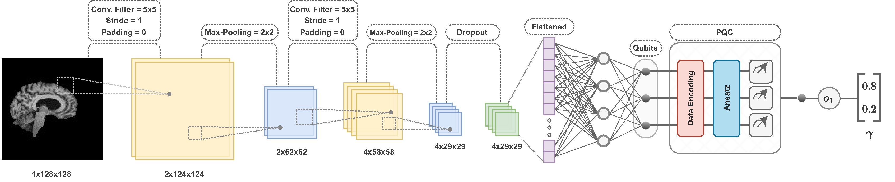

## CQ-CNN: A Hybrid Classical-Quantum Convolutional Neural Network

<p align="left">

</p>

<b>CQ-CNN: A Hybrid Classical-Quantum Convolutional Neural Network for Alzheimer’s Disease Detection Using Diffusion-Generated and U-Net Segmented 3D MRI</b>

<p>Mominul Islam, Mohammad Junayed Hasan, M.R.C. Mahdy</p>

[https://doi.org/10.48550/arXiv.2503.02345](https://doi.org/10.48550/arXiv.2503.02345)<br>

<p>Abstract: <i>The detection of Alzheimer’s disease (AD) from clinical MRI data is an active area of research in medical imaging Recent advances in quantum computing, particularly the integration of parameterized quantum circuits (PQCs) with classical machine learning architectures, offer new opportunities to develop models that may outperform traditional methods. However, quantum machine learning (QML) remains in its early stages and requires further experimental analysis to better understand its behavior and limitations. In this paper, we propose an end-to-end hybrid classical-quantum convolutional neural network (CQ-CNN) for AD detection using clinically formatted 3D MRI data. Our approach involves developing a framework to make 3D MRI data usable for machine learning, designing and training a brain tissue segmentation model (SkullNet), and training a diffusion model to generate synthetic images for the minority class. Our converged models exhibit potential quantum advantages, achieving higher accuracy in fewer epochs than classical models. The proposed 𝛽<sub>8</sub>-3-qubit model achieves an accuracy of 97.50%, surpassing state-of-the-art (SOTA) models while requiring significantly fewer computational resources. In particular, the architecture employs only 13K parameters (0.48 MB), reducing the parameter count by more than 99.99% compared to current SOTA models. Furthermore, the diffusion-generated data used to train our quantum models, in conjunction with real samples, preserve clinical structural standards, representing a notable first in the field of QML. We conclude that CQ-CNN architecture-like models, with further improvements in gradient optimization techniques, could become a viable option and even a potential alternative to classical models for AD detection, especially in data-limited and resource-constrained clinical settings.</i></p>

## 1a. Dependency Setup

This project requires two separate conda environments. Follow these steps to install the necessary packages on Windows:

1. Navigate to the `environments/` directory:
    ```bash
    cd environments/
    ```

2. Create the conda environments using the provided YAML files:
    ```bash
    conda env create -f quantum.yml
    conda env create -f classical.yml
    ```

## 1b. Activating Environments

- **Quantum Environment:** The following files require the `quantum` environment to be activated:

    ```
    scripts/
    |-- classifiers/
    |---- 2qubits/
    |------ ...
    |---- 3qubits/
    |------ ...
    ```

    To activate the `quantum` environment, run:
    ```bash
    conda activate quantum
    ```

- **Classical Environment:** The remaining notebooks require the `classical` environment. To activate it, run:
    ```bash
    conda activate classical
    ```

## 2a. Datasets

Download the following datasets:

- [NFBS](http://preprocessed-connectomes-project.org/NFB_skullstripped)
- [OASIS-2](https://sites.wustl.edu/oasisbrains/home/oasis-2)

## 2b. Organizing Datasets

After downloading the datasets, create a folder named `datasets` in the root directory. Organize the folders, downloaded `.tar.gz` files, and metadata as shown below:

```
datasets/
|-- NFBS/
|---- downloads/
|------ NFBS_Dataset.tar.gz
|-- OASIS-2/
|---- downloads/
|------ OAS2_RAW_PART1.tar.gz
|------ OAS2_RAW_PART2.tar.gz
|------ OAS2_metadata.xlsx
```

Make sure to rename the files and folders as needed.

## 2c. Preprocessing NFBS and Training SkullNet

To train the **SkullNet** segmentation model, start by preprocessing the NFBS dataset. This process converts the 3D MRI data into 2D images. Run the following script for preprocessing:

```
nfbs-preprocessing.ipynb
```

After preprocessing, proceed to train the **SkullNet** segmentation model with the following script:

```
nfbs-unet-train.ipynb
```

## 2d. Preprocessing OASIS-2, Training Diffusion Models, and Creating Dataset Variations

For the **OASIS-2** dataset, start by converting the 3D MRI data into 2D images. The images are then divided into classes based on metadata, and we create variations for axial, coronal, and sagittal views.

Run the preprocessing script:

```
oasis-2-preprocessing.ipynb
```

To address class imbalance, we train **three separate diffusion models** for the minority class (moderate dementia) in axial, coronal, and sagittal views. These models generate synthetic images. Run the following scripts to train the diffusion models:

```
oasis-2-diffusion-train-axial.ipynb
oasis-2-diffusion-train-coronal.ipynb
oasis-2-diffusion-train-sagittal.ipynb
```

These models are trained on [Kaggle](https://www.kaggle.com/). Once training is complete, create the following folder structure and store the generated images in the respective `moderate_dementia` folders:

```
datasets/
|-- OASIS-2/
|---- generated/
|------ axial/
|-------- moderate_dementia/
|------ coronal/
|-------- moderate_dementia/
|------ sagittal/
|-------- moderate_dementia/
```

Next, run the following script to create the final balanced variations of the dataset:

```
oasis-2-eda-and-pruning.ipynb
```

Finally, use **SkullNet** to generate segmented variations of the OASIS-2 dataset by running:

```
oasis-2-skullstrip.ipynb
```

## 2e. Trained Models

We provide pre-trained models for both segmentation and generative tasks.

### Segmentation Model
Download the segmentation model from [GitHub Releases v1.0.1](https://github.com/mominul-ssv/alz-cq-cnn/releases/tag/v1.0.1).

### Generative Models
Download the generative models from [GitHub Releases v1.0.0](https://github.com/mominul-ssv/alz-cq-cnn/releases/tag/v1.0.0).

| Model Type | Download Link |
|------------|---------------|
| **Axial**  | [Download](https://github.com/mominul-ssv/alz-cq-cnn/releases/download/v1.0.0/oasis-2_axial_gen_model.pt) |
| **Coronal**| [Download](https://github.com/mominul-ssv/alz-cq-cnn/releases/download/v1.0.0/oasis-2_coronal_gen_model.pt) |
| **Sagittal**| [Download](https://github.com/mominul-ssv/alz-cq-cnn/releases/download/v1.0.0/oasis-2_sagittal_gen_model.pt) |

## 3. Training Classifiers with CQ-CNNs

To train the classification models for all variations of the OASIS-2 dataset, run the scripts in the following directories:

```
scripts/
|-- classifiers/
|---- 2qubits/
|------ ...
|---- 3qubits/
|------ ...
|---- classical/
|------ ...
```

## 4. Performance Evaluation

For an in-depth analysis of our experiments, including segmentation, generative, and classification models, run the following scripts:

```
model-segmentation-eda.ipynb
model-generative-eda.ipynb
model-classification-eda.ipynb
```

## 5. Citation
```
@article{islam2025cq,
  title={CQ CNN: A Hybrid Classical Quantum Convolutional Neural Network for Alzheimer's Disease Detection Using Diffusion Generated and U Net Segmented 3D MRI},
  author={Islam, Mominul and Hasan, Mohammad Junayed and Mahdy, MRC},
  journal={arXiv preprint arXiv:2503.02345},
  year={2025}
}
```

## 6. License
- Copyright © Mominul Islam.
- ORCID iD: https://orcid.org/0009-0001-6409-964X


